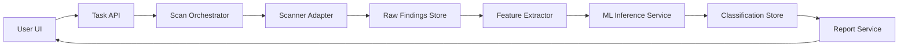

# Web 漏洞扫描与机器学习分析系统设计

Feature Name: web-vuln-ml-system
Updated: 2026-04-08

## Description

系统采用“扫描引擎 + 特征分析 + 模型推理 + 报告服务”的流水线设计。传统扫描器负责高召回检测，机器学习分类器负责降低误报，最终输出可审计、可追踪的漏洞报告。

## Architecture

- 数据层：MySQL 存储任务、漏洞与分类结果，Object Storage 存储原始证据。
- 业务层：任务编排、特征提取、模型推理、报告生成。
- 表示层：Web 控制台和 API。

## Components and Interfaces

- `Task API`
  - `POST /api/tasks` 创建扫描任务。
  - `GET /api/tasks/{id}` 查询任务状态与进度。
- `Scan Orchestrator`
  - 负责任务调度、超时控制、失败重试。
- `Feature Extractor`
  - 输入原始漏洞结果，输出标准化特征向量。
- `ML Inference Service`
  - 输入特征向量，输出 `label`、`confidence`、`model_version`。
- `Report Service`
  - 聚合漏洞、分类、证据与修复建议，输出报告视图。

## Data Models

- `scan_tasks`
  - `id`, `target_url`, `status`, `created_at`, `finished_at`, `error_message`
- `scan_findings`
  - `id`, `task_id`, `vuln_type`, `severity_raw`, `evidence`, `location`, `created_at`
- `finding_features`
  - `id`, `finding_id`, `feature_json`, `extractor_version`, `created_at`
- `finding_classifications`
  - `id`, `finding_id`, `label`, `confidence`, `model_version`, `created_at`
- `reports`
  - `id`, `task_id`, `summary_json`, `generated_at`

## Correctness Properties

- 每条 `scan_findings` 必须关联且仅关联一个 `scan_tasks`。
- 每条分类结果必须携带 `model_version`，用于回溯。
- 报告生成必须基于同一任务快照，避免跨任务数据混合。

## Error Handling

- 扫描失败：标记任务为 `failed`，记录结构化错误码与消息。
- 特征提取失败：将漏洞置为 `feature_error`，可重试处理。
- 模型不可用：降级为规则基线判定并记录 `degraded=true`。
- 报告生成失败：保留中间数据，允许用户手动重新生成。

## Test Strategy

- 单元测试：任务状态机、特征提取函数、分类结果映射。
- 集成测试：扫描结果入库到报告生成全链路。
- 回归测试：使用标注数据集验证误报率与召回率变化。
- 性能测试：并发任务压测与接口响应时间监控。
- 安全测试：鉴权绕过、注入输入、敏感数据泄露检查。

## References

[^1]: (requirements.md) - 需求定义与验收标准 `.monkeycode/specs/web-vuln-ml-system/requirements.md`
